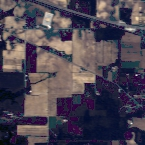
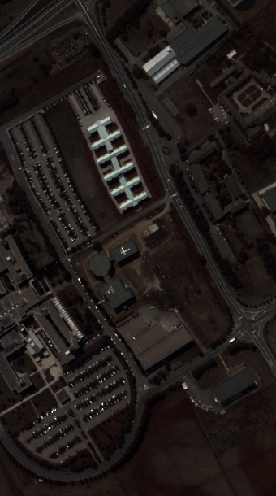
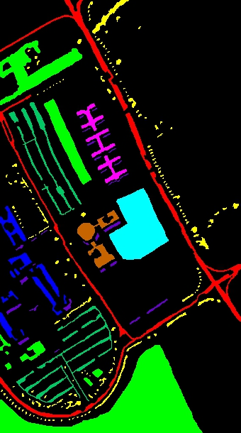
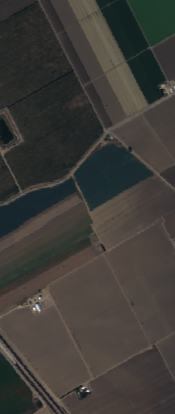
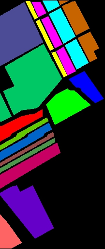

# **HybridSN**

This is a personal *pytorch-based* implement of **HybridSN** by Jupyter notebook.

The HybridSN is spectral-spatial 3D-CNN followed by spatial 2D-CNN.The 3D-CNN facilitates the joint spatial-spectral feature representation from a stack of spectral bands. The 2D-CNN on top of the 3D-CNN further learns more abstract level spatial representation.

The paper link: ["HybridSN: Exploring 3-D–2-D CNN Feature Hierarchy for Hyperspectral Image Classification"](https://ieeexplore.ieee.org/document/8736016)

Official keras code: [gokriznastic/HybridSN
](https://github.com/gokriznastic/HybridSN)

# Requirements

pytorch 1.9.0
scikit-learn 1.0.2
spectral 0.22.2
torchinfo 1.6.1

# Results

Fig. Images of IndianPines (a) RGB  (b) groundtruth  (c) predition

Fig. Images of Pavia University (a) RGB  (b) groundtruth  (c) predition

Fig. Images of Salinas Scene (a) RGB  (b) groundtruth  (c) predition
